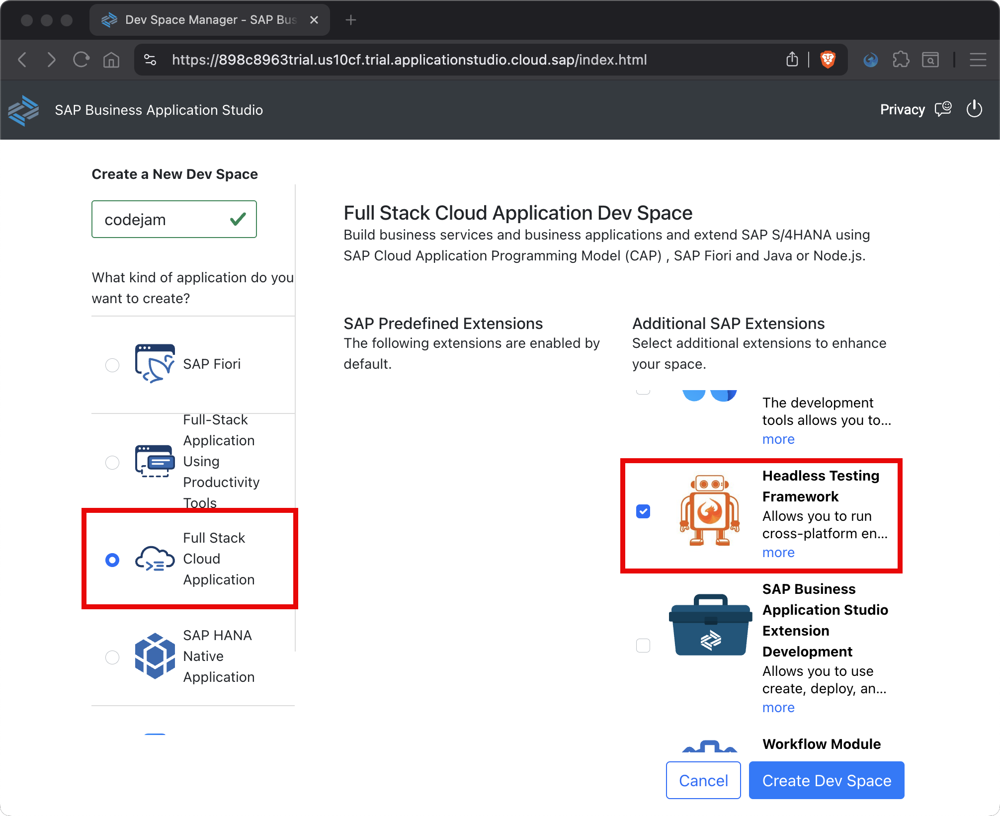

# Chapter 00 - Preparing the Development Environment

By the end of this chapter we will have prepared our development environment so that we can start developing our application.

## Steps

[1. Prerequisites](#1-prerequisites)<br>
[2. Navigate into your preferred directory](#2-navigate-into-your-preferred-directory)<br>
[3. Clone this repository](#3-clone-this-repository)<br>
[4. Navigate into the newly created directory](#4-navigate-into-the-newly-created-directory)<br>
[5. Open the directory](#5-open-the-directory)<br>

### 1. Prerequisites

To be able to follow the instructions in this repository you need to fulfill ***one*** of the following requirements:

- **Option 1:** You have access to an instance of the SAP Business Application Studio with the role collection `Business_Application_Studio_Developer` assigned to you in the SAP Business Technology Platform Cockpit. Create a new dev space of type `Full Stack Cloud Application` to get started. Make sure to also check the `Headless Testing Framework` option when creating the dev space, as this will install the necessary tools for running `wdi5` tests.



> If you don't have access to the SAP Business Application Studio yet, check this tutorial on [how to get a free account on SAP BTP trial](https://developers.sap.com/tutorials/hcp-create-trial-account.html), from where you can [subscribe to the SAP Business Application Studio](https://developers.sap.com/tutorials/appstudio-onboarding.html).

- **Option 2:** You can use your local machine and have the following tools installed:
  - [Node.js](https://nodejs.org/en/) (version 20 or higher) including `npm`
  - [git](https://git-scm.com/book/en/v2/Getting-Started-Installing-Git)
  - Your favorite code editor (e.g. [Visual Studio Code](https://code.visualstudio.com/download))
  - You need privileges to install npm packages from the [npm registry](https://www.npmjs.com/)

- **Option 3:** You can run this project in a devcontainer using the [provided configuration](/.devcontainer). You need to meet *one* of the following requirements:
  - **Option 3a**: You have GitHub codespaces enabled for your GitHub organization and account.
  - **Option 3b**: You have [Docker Desktop](https://www.docker.com/products/docker-desktop/) installed on your machine and can use a [Visual Studio Code extension](https://marketplace.visualstudio.com/items?itemName=ms-vscode-remote.remote-containers) to run the devcontainer locally.

### 2. Navigate into your preferred directory

➡️ In your development environment (see [step 1](#1-prerequisites)), open a new terminal session and navigate to where you want to store this repository.

### 3. Clone this repository

➡️ Execute the following command to clone this repository:

```bash
git clone https://github.com/SAP-samples/ui5-advanced-exercises-codejam
```

The command created new directory for the cloned repository.

### 4. Navigate into the newly created directory

We want to navigate into the newly created `ui5-advanced-exercises-codejam/` directory.

➡️ Execute the following command in the same terminal session:

```bash
cd ui5-advanced-exercises-codejam/
```

### 5. Open the directory

➡️ Open the directory in the code editor of your choice, depending on the option you chose in [step 1](#1-prerequisites).

Continue to [Chapter 01 - Generating a Full-Stack Project](/chapters/01-generating-full-stack-project/)
