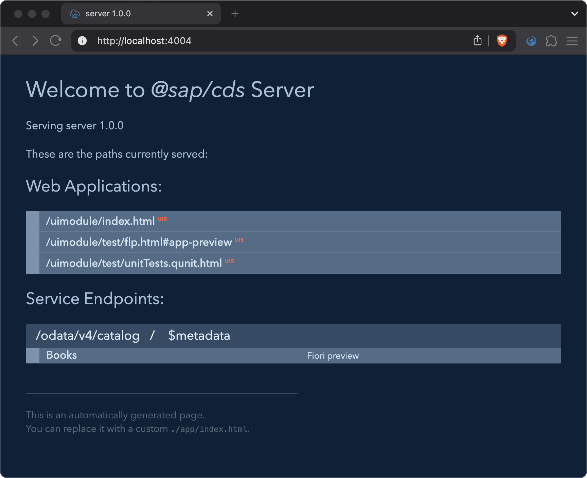
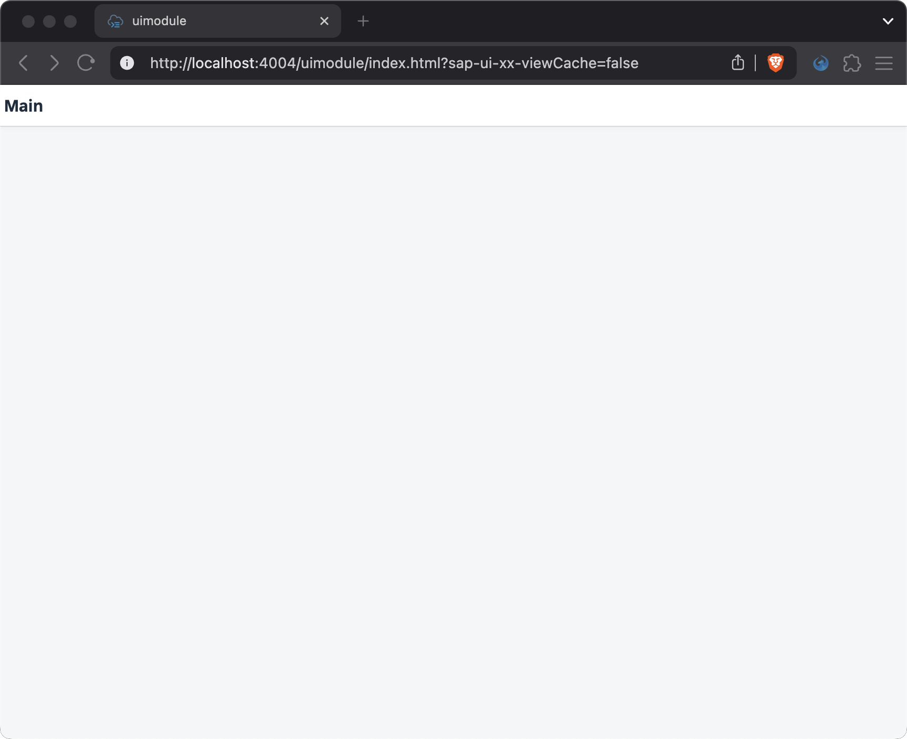

# Chapter 01 - Generating a Full-Stack Project

By the end of this chapter we will have generated a UI5 application (TypeScript-based) as well an [SAP Cloud Application Programming Model](https://cap.cloud.sap/docs/) (CAP) server in a monorepo setup (via [npm workspaces](https://docs.npmjs.com/cli/v7/using-npm/workspaces)), which will serve as the foundation for the upcoming exercises.

## Steps

- [1. Install the easy-ui5 generator](#1-install-the-easy-ui5-generator)<br>
- [2. Run the project generator](#2-run-the-project-generator)<br>
- [3. Add an SAP CAP server to the project](#3-add-an-sap-cap-server-to-the-project)<br>
- [4. Install dependencies](#4-install-dependencies)<br>
- [5. Add a `dev:server` script to the project root](#5-add-a-devserver-script-to-the-project-root)<br>
- [6. Test the application](#6-test-the-application)<br>

### 1. Install the easy-ui5 generator

We will use the [`easy-ui5` generator](https://github.com/SAP/generator-easy-ui5/) to generate our UI5 application.

➡️ Execute the following command in the terminal to install the generator globally:

```bash
npm install -g generator-easy-ui5 yo
```

We installed the easy-ui5 generator globally, as well as the [`yo` (Yeoman) utility](https://www.npmjs.com/package/yo), which is the engine behind the generator.

### 2. Run the project generator

Next, we want to run the [project generator](https://github.com/ui5-community/generator-ui5-project/), which is a sub-generator of the easy-ui5 generator.

➡️ Execute the following command in the terminal to generate the project and enter the below details when prompted:

```bash
yo easy-ui5 project project
```

|Prompt|Answer|
|---|---|
|Which namespace do you want to use?|`codejam`|
|How do you want to name this project|`supermarket`|
|How do you want to name the first uimodule within your app?|`uimodule`|
|Do you want to enable the SAP Fiori elements flexible programming model?|`Yes`|
|Do you want to use the awesomeness of TypeScript?|`Yes`|
|Do you want the module to be visible in the SAP Fiori tools?|`Yes`|
|On which platform would you like to host the application?|`Application Frontend Service`|
|Where should your UI5 libs be served from?|`Local resources (SAPUI5)`|
|Would you like to create a new directory for the project?|`Yes`|
|Would you like to initialize a local git repository for the project?|`Yes`|
|Does your main service already exist, so we can fetch its metadata?|`No`|
|What entity should be used for the new page?|`Products`|
|What type of page do you want to add?|`Custom Page`|
|How do you want to name your custom page view?|`Main`|
|*Accept to overwrite existing files.*||

We used the easy-ui5 project generator to generate a TypeScript-based UI5 project. The project generator is a sub-generator of easy-ui5, and itself contains (sub-)sub-generators, such as `project` (hence `project project` in the command). This nested structure of generators, together with the monorepo approach of the used templates, allows for very flexible and modular scaffolding of applications and features. These capabilities are by the way also the major difference between the project generator and the [`ts-app` generator](https://github.com/ui5-community/generator-ui5-ts-app), which generates simpler applications without the monorepo setup and doesn't include (sub-)sub-generators to add more features on the fly.

To better understand the generated monorepo project setup, you can inspect the root `codejam.supermarket/package.json` file of the generated project, more specifically the `workspaces` object, which is the heart of our monorepo configuration.

<details>
<summary>What is a monorepo and how does it work? 💬</summary>

<br>

> A monorepo (short for "monolithic repository") is a software development strategy where multiple projects or components are stored in a single version control repository. This approach allows for better collaboration, code sharing, and dependency management across different projects within the same organization.
>
> In our case, we are using a monorepo setup with [npm workspaces](https://docs.npmjs.com/cli/v7/using-npm/workspaces), which allows us to manage multiple packages (in this case, the UI5 app and the CAP server) within a single repository. This makes it easier to share and connect dependencies, manage versions, and maintain consistency across different parts of the project.

</details>

<br>

At this point you might be wondering why we enabled the SAP Fiori elements flexible programming model (FPM) for our UI5 application (`uimodule`). The reasons here are (1) that the FPM templates support TypeScript and (2) that the FPM allows us to use all the freestyle development features of UI5 (via custom pages or fragments), while still providing a solid structure and the option of adding Fiori elements features later on, such as [building blocks](https://sapui5.hana.ondemand.com/test-resources/sap/fe/core/fpmExplorer/index.html#/buildingBlocks/buildingBlockOverview) or whole pages (e.g object page). 

### 3. Add an SAP CAP server to the project

As a next step, we will turn our UI5 project into a full-stack project by adding an [SAP Cloud Application Programming Model](https://cap.cloud.sap/docs/) (CAP) server.

Execute the following commands to enter the project directory and generate a CAP server. Also enter the below details when prompted:

```bash
cd codejam.supermarket/
yo easy-ui5 project cap
```

|Prompt|Answer|
|---|---|
|How do you want to name your new SAP CAP server module?|`server`|
|Which CAP capabilities do you want to add?|**select** `hana`, **unselect** `postgres`|
|Do you want to add the SAP CAP service as the default model to your uimodule?|`Yes`|
|*Accept to install packages and overwrite existing files.*||

We ran the `cap` (sub-)sub-generator to add a CAP server to our project, which makes sure it is well-integrated into the monorepo, for example by sharing dependencies at root level. The server will serve (pun intended) as the backend for our UI5 app - conveniently, the generator even added the CAP service as a data source and default data model. By default, it comes with a tiny sample service, which you are free to inspect of course (directories `codejam.supermarket/server/db/` and `codejam.supermarket/server/srv/`).

Since we want to be able to launch our UI5 app (`uimodule`) and the CAP server with a single command and have them run on the same port (during dev time), the CAP server is equipped with the [`cds-plugin-ui5`](https://www.npmjs.com/package/cds-plugin-ui5). Feel free to inspect the `codejam.supermarket/server/package.json` file to see the `cds-plugin-ui5` listed as dev dependency, as well as the `uimodule`, which is required to make the plugin aware of the application.

<details>
<summary>A few more thoughts on the `cds-plugin-ui5`... 💬</summary>

<br>

>Using the `cds-plugin-ui5` allows us to start our full-stack application with a single command and have the frontend and backend run on one port. This removes the need to setup a proxy from the UI5 server to the CAP server (they are one now). It is made possible due to the fact that both the [UI5 Tooling](https://sap.github.io/ui5-tooling) and the CAP server are based on [express](https://www.npmjs.com/package/express), a popular web server framework for Node.js. This CAP-centric approach (meaining starting the CAP server and hooking the UI5 server into it) works via the CAP [`cds-plugin` technique](https://cap.cloud.sap/docs/node.js/cds-plugins). There is also a UI5-first approach (manually starting the UI5 server and launching the CAP server behind the scenes) in the form of the [`ui5-middleware-cap`](https://www.npmjs.com/package/ui5-middleware-cap).
>
>At this point, one might argue that CAP already by default serves `.html` files inside the `app/` directory, including UI5 applications, but this approach doesn't use the UI5 Tooling, hence the `ui5.yaml` of the UI5 application is being ignored. That approach also doesn't support monorepo or non-standard project setups. So to have that true full-stack and seamless experience with all the tooling available, we need the `cds-plugin-ui5`.

</details>

### 4. Install dependencies

After adding the CAP server to our project, we need to make sure all new dependencies are being installed.

➡️ Execute the following command from the project root (`codejam.supermarket/`):

```bash
npm install
```

### 5. Add a `dev:server` script to the project root

To make it easier to start the CAP server in dev mode (meaning `cds watch` - which also starts the UI5 server behind the scenes), we will add a `dev:server` script to the project root (`codejam.supermarket/package.json`).

➡️ Add the following code at the end of `scripts` section of the `codejam.supermarket/package.json` file:

```json
,
        "dev:server": "npm run dev --workspace server"
```

We added a new script to the project root that triggers the `dev` script (`npm run dev`) of the CAP server (`--workspace server`). This script in turn is configured to run `cds watch` (see `codejam.supermarket/server/package.json`), which watches the file system and restarts the server upon changes. As described above, the UI5 server will also be started with the help of the `cds-plugin-ui5`.

### 6. Test the application

➡️ Execute the following command from the project root (`codejam.supermarket/`):

```bash
npm run dev:server
```

The home page of the CAP server display all CAP service endpoints as well as the UI5 app(s) - notice the small UI5 label next to the webapp paths, which indicates that these are in fact UI5 apps served via the UI5 server, and not just static HTML files.

As of now, our UI5 app is still empty and only displays the "Main" title. We will add content to the app in the following chapters.




Continue to [Chapter 02 - Preparing the CAP Server](/chapters/02-preparing-cap-server/)
