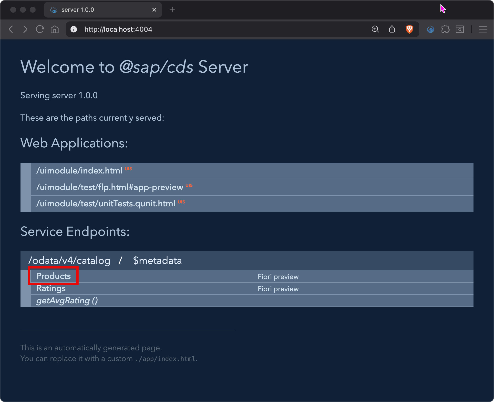
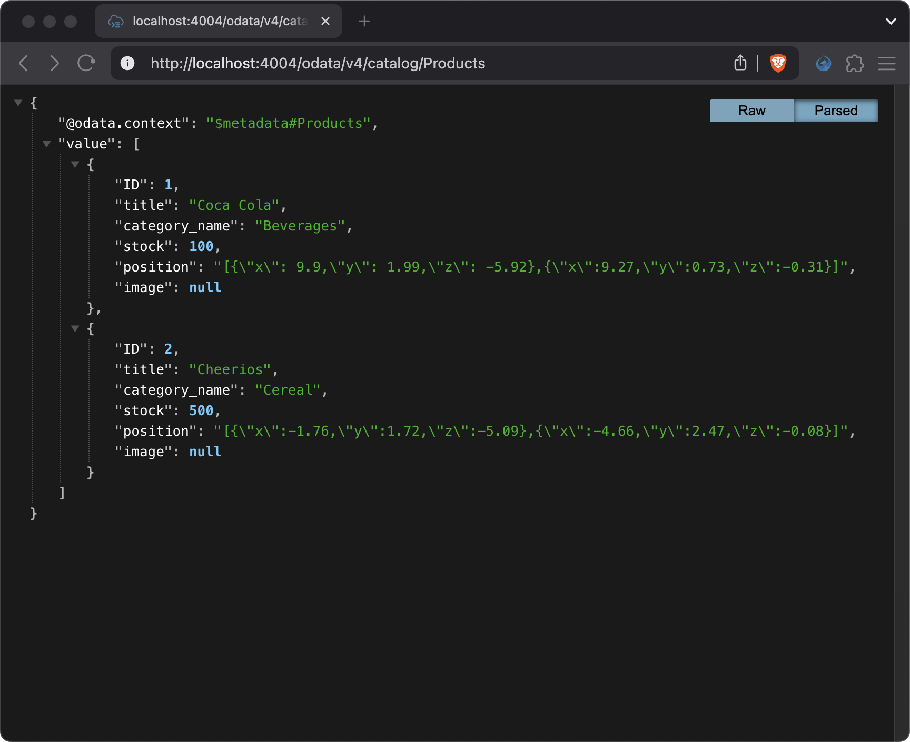

# Chapter 02 - Preparing the CAP Server

By the end of this chapter we will have prepared our CAP server for the scenario we want to built, which is a supermarket application, that allows user to browse a list of products. This chapter has little (nothing) to do with UI5, but is necessary to get the backend ready for the UI5 app.

## Steps

- [1. Replace the data model](#1-replace-the-data-model)<br>
- [2. Add sample data](#2-add-sample-data)<br>
- [3. Add a service definition](#3-add-a-service-definition)<br>
- [4. Test the CAP server](#4-test-the-cap-server)<br>

### 1. Replace the data model

Our CAP server by default was generated including a bookshop data model. We will replace it with a supermarket data model.

➡️ Replace the content of the `codejam.supermarket/server/db/schema.cds` file with the following code:

```cds
namespace supermarket;

using { cuid, managed } from '@sap/cds/common';

entity Products {
    key ID       : Integer;
        title    : String;
        category : Association to one Categories;
        stock    : Integer;
        position : String;
        image    : String;
}

entity Categories {
    key name     : String;
        products : Association to many Products;
}

entity Ratings: cuid, managed {
	rating: Integer @assert.range: [1,5];
}
```

### 2. Add sample data

We will add sample data to our CAP server, so that we can test the UI5 app later on.

➡️ Delete all files inside the `codejam.supermarket/server/db/data/` directory and create the following new files inside that directory (naming is important!):

**supermarket-Products.csv**
```csv
ID,title,category_name,stock,position,image
1,Coca Cola,Beverages,100,"[{""x"": 9.9,""y"": 1.99,""z"": -5.92},{""x"":9.27,""y"":0.73,""z"":-0.31}]",https://codejam-supermarket-image-server.cfapps.us10.hana.ondemand.com/1.png
2,Cheerios,Cereal,500,"[{""x"":-1.76,""y"":1.72,""z"":-5.09},{""x"":-4.66,""y"":2.47,""z"":-0.08}]",https://codejam-supermarket-image-server.cfapps.us10.hana.ondemand.com/2.png
```

**supermarket-Categories.csv**
```csv
name
Beverages
Cereal
```

**supermarket-Ratings.csv**
```csv
rating
4
5
```

### 3. Add a service definition

We want to expose the data model via a service, so that we can consume it in our UI5 app.

➡️ Replace the current content of the `codejam.supermarket/server/srv/cat-service.cds` file with the following code:

```cds
using supermarket from '../db/schema';

service CatalogService {
    @readonly
    entity Products as projection on supermarket.Products;

    @readonly
    entity Ratings  as projection on supermarket.Ratings;

	action createRating(rating : Integer) returns Ratings;
    function getAvgRating() returns Decimal;
}
```

### 4. Test the CAP server

➡️ Refresh your browser window at `http://localhost:4004/` and inspect the service enpoints. In case you closed your server, restart it with the following command from the project root:

```bash
npm run dev:server
```

The CAP server is now serving the products data via the defined service and underlying supermarket data model. By default, the service protocol is OData V4.




Continue to [Chapter 03 - Adding Content to the UI5 Application](/chapters/03-adding-content-to-ui5-app/)
