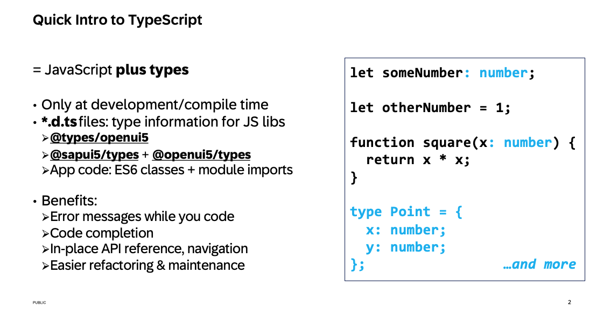
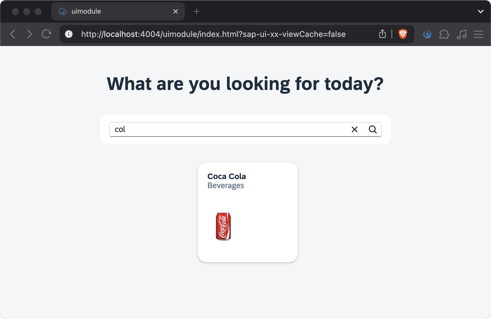

# Chapter 03 - Adding Content to the UI5 Application

By the end of this chapter we will have added basic features to our UI5 application, that allow users to browse a list of supermarket products.

## Steps

- [1. Add basic controls to the UI5 application](#1-add-basic-controls-to-the-ui5-application)<br>
- [2. Add TypeScript controller code for the search feature](#2-add-typescript-controller-code-for-the-search-feature)<br>
- [3. Test the application](#3-test-the-application)<br>

### 1. Add basic controls to the UI5 application

We want to build an app that allow users to browse and search a list of products in a supermarket. For that we need some basic UI5 controls, specifically for the title, search field and list of products.

➡️ Replace the current content of the `codejam.supermarket/uimodule/webapp/ext/main/Main.view.xml` file with the following code:

```xml
<mvc:View
	xmlns:core="sap.ui.core"
	xmlns:mvc="sap.ui.core.mvc"
	xmlns="sap.m"
	xmlns:f="sap.f"
	xmlns:macros="sap.fe.macros"
	xmlns:html="http://www.w3.org/1999/xhtml"
	controllerName="uimodule.ext.main.Main">
	<Page id="Main" showHeader="false" class="sapUiContentPadding">
		<VBox justifyContent="SpaceBetween" width="100%" height="100%">
			<VBox alignItems="Center">
				<Title
					level="H2"
					titleStyle="H2"
					text="What are you looking for today?"
					class="sapUiMediumMarginTop" />
				<Panel class="sapUiMediumMarginTop">
					<SearchField
                        id="searchField"
						placeholder="Find products"
						liveChange=".onSearchProducts"
						width="480px" />
				</Panel>
				<HBox
					id="products"
					items="{path: '/Products', parameters: { '$select': '*' }}"
					class="sapUiMediumMarginTop"
					wrap="Wrap"
					justifyContent="Center">
					<GenericTile
						header="{title}"
						subheader="{category_name}"
						press=".onFlyToProduct"
						class="sapUiTinyMarginBegin sapUiTinyMarginBottom">
						<TileContent>
							<ImageContent src="{image}" />
						</TileContent>
					</GenericTile>
				</HBox>
			</VBox>
		</VBox>
	</Page>
</mvc:View>
```

We added basic UI5 controls to the main view custom page. As we call these exercises "advanced", nothing here should really surprise you.

### 2. Add TypeScript controller code for the search feature

➡️ Add the following method to the `codejam.supermarket/uimodule/webapp/ext/main/Main.controller.ts` file:

```typescript
public onSearchProducts(event: SearchField$LiveChangeEvent): void {
    const filter = []
    const query = event.getParameter("newValue")
    if (query) {
        filter.push(new Filter({
            path: "title",
            operator: FilterOperator.Contains,
            value1: query,
            caseSensitive: false
        }))
    }
    const list = this.getView()?.byId("products") as HBox
    const binding = list.getBinding("items") as ODataListBinding
    binding.filter(filter)
}
```

➡️ Also make sure to add the following imports to the top of the same file:

```typescript
import { SearchField$LiveChangeEvent } from "sap/m/SearchField";
import Filter from "sap/ui/model/Filter";
import FilterOperator from "sap/ui/model/FilterOperator";
import HBox from "sap/m/HBox";
import ODataListBinding from "sap/ui/model/odata/v4/ODataListBinding";
```

We added a search feature to the main view, which allows users to search for products by their title. The search is done by getting the search parameter (`newValue`) from the `SearchField$LiveChangeEvent`, instatiating a new filter, and applying that filter to the OData binding of the products list. We bound this `onSearchProducts` method to the `liveChange` event of the `SearchField` control in the previous step.

Since we now actively used TypeScript (TS) for the first time in our app, it's probably a good time to talk about TS usage in UI5. TS is a superset of JavaScript (JS), meaning that JS is always valid TS, but not vice versa. TS adds additional features to JS, such as static typing, interfaces, and more. This allows us to write more robust and maintainable code. One of many great benefits we get when using TS in UI5 is the autocompletion of the TS language server. As everything in TS has a type (and all of UI5 has been typed to be compatible), your IDE can provide you with all available properties and methods of UI5 controls and classes. This is a huge improvement over the traditional JS approach, where you often have to rely on documentation or trial and error to figure out how to use a control or class.

Check out this overview slide created by [Peter Muessig](https://github.com/petermuessig) as part of his Devtoberfest session [UI5 Freestyle: TypeScript E2E Development - from zero to hero in 1hr!](https://www.youtube.com/watch?v=7aAehB4ejHQ) (highly recommended!):



<details>
<summary>A few more thoughts on the `Control$Event` syntax ... 💬</summary>

<br>

>

</details>

### 3. Test the application

➡️ Refresh your browser window at `http://localhost:4004/` and test the application. In case you closed your server, restart it with the following command from the project root:

```bash
npm run dev:server
```

The application now contains a list of products and the search field. Feel free to test the search, which by the way in case insensitive (the filter was instantiated using `caseSensitive: false`).



## Further question to discuss

<details>
<summary>Do you know why our `main` view and controller are nested inside an `ext/` directory, instead of using the usual freestyle UI5 structure of `webapp/view/` and `webapp/controller/`? (The answer is in the question already.)</summary>

<br>

> We use the SAP Fiori elements flexible programming model (FPM) for our UI5 application (instead of going full freestyle), which allows us to use custom pages and fragments within the boundaries of SAP Fiori elements. The `ext/` directory is a convention used by the FPM to indicate that the view and controller are extensions of the main view and controller. This allows us to keep the custom code separate from the generated (framework) code, making it easier to maintain and update the application in the future.

</details>

Continue to [Chapter 04 - Adding OData V4 Actions and Debugging](/chapters/04-adding-odata-v4-actions-and-debugging/)
