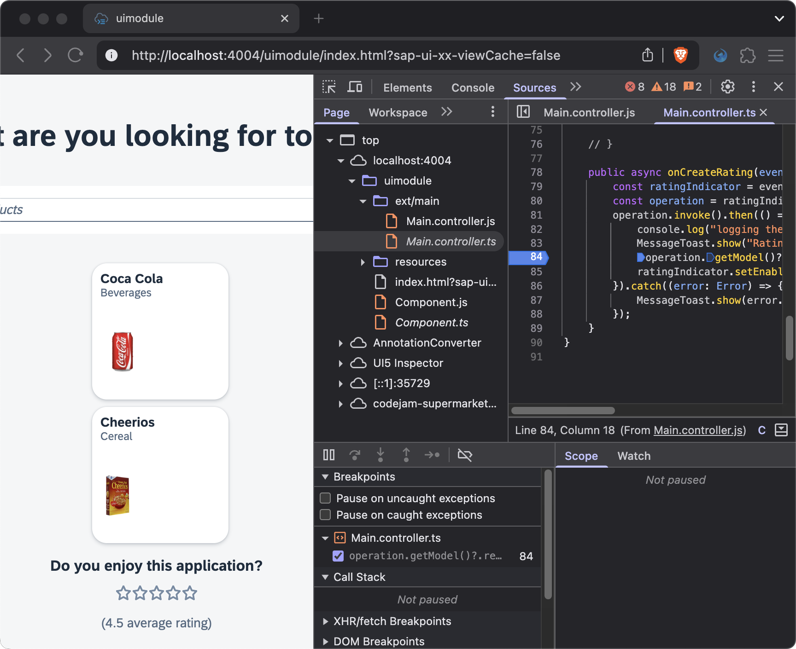
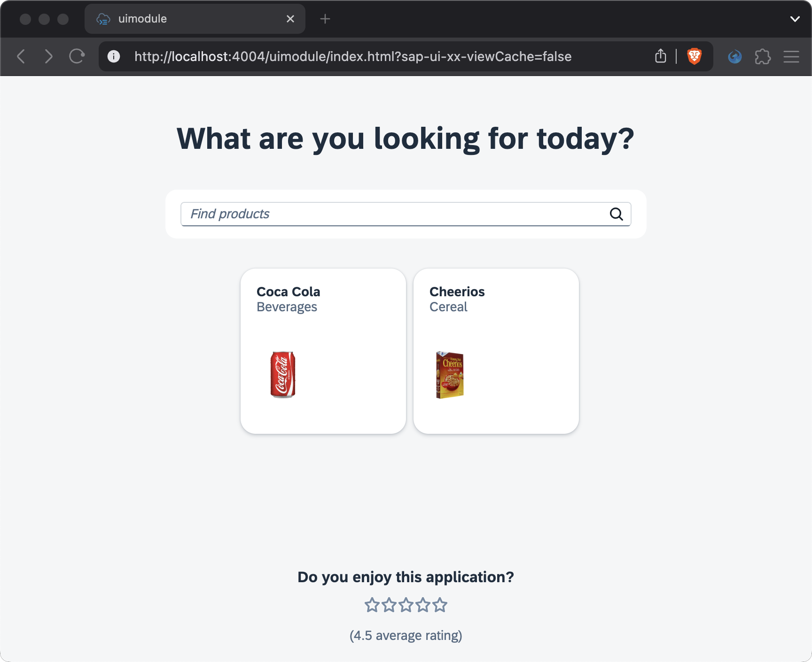

# Chapter 04 - Adding OData V4 Actions and Debugging

By the end of this chapter we will have added and invoked an OData V4 action binding to our UI5 application, so users submit a rating. We will also have talked about debugging strategies.

## Steps

- [1. Add a rating indicator to the XML view](#1-add-a-rating-indicator-to-the-xml-view)<br>
- [2. Implement the controller](#2-implement-the-controller)<br>
- [3. Debugging](#3-debugging)<br>
- [4. Test the application](#4-test-the-application)<br>

### 1. Add a rating indicator to the XML view

We want to add a rating indicator to our XML view, that allows user to rate the application.

➡️ Add the following code to the end of the outer `<VBox />` element in the `codejam.supermarket/uimodule/webapp/ext/main/Main.view.xml` file:

```xml
			<VBox alignItems="Center">
				<Title text="Do you enjoy this application?" />
				<RatingIndicator
					binding="{/createRating(...)}"
					change=".onCreateRating"
					maxValue="5"
					value="{$Parameter/rating}"
					class="sapUiSmallMarginBottom" />
				<Label id="avgRating" text="({ path: '/getAvgRating()', type: 'sap.ui.model.odata.type.Decimal' } average rating)" />
			</VBox>
		</VBox>
```

We added a `<RatingIndicator />` control that uses a [deferred operation binding](https://ui5.sap.com/#/topic/b54f7895b7594c61a83fa7257fa9d13f) for the Odata V4 action `/createRating(...)`, more specifically a deferred *action* binding (action/function depending on the type of OData operation). A deferred operation binding is defined via the `(...)` syntax. It is "deferred", because it is not called immediately - unlike the simple function binding `/getAvgRating()` that is used to get the average rating from the backend. Deferred operation bindings are often called with parameters, which can be set via the `setParameter("rating", "<value>")` method or more declaratively via the `{$Parameter/rating}` syntax, which we did here.

The rating indicator calls the `onCreateRating()` method on the change event, which we will implement in the next step. This is where the OData action will actually be invoked.

<details>
<summary>A few more thoughts on accessing and updating data with OData V4 ... 💬</summary>

<br>

> The [OData V4 model](https://ui5.sap.com/#/api/sap.ui.model.odata.v4.ODataModel) in UI5 does ***not*** allow for direct (or "manual") data model access or manipulation via the `getProperty()` or `setProperty()` methods - unlike the [OData V2 model](https://ui5.sap.com/#/api/sap.ui.model.odata.v2.ODataModel%23methods/Summary) or [JSON model](https://ui5.sap.com/#/api/sap.ui.model.json.JSONModel). Instead, the context API ([ODataContextBinding](https://ui5.sap.com/#/api/sap.ui.model.odata.v4.ODataContextBinding)) plays the most central role and is used to access and manipulate data. It is therefore considered a best practice to use bindings whenever possible. Data model properties (a path in the model) are bound to control properties, which means that changes to the control and therefore the data model (two-way binding) then also automatically update the backend. Simple function bindings or deferred operation bindings like shown above are used to manipulate data (never do "manual" calculations on the client side). This approach requires the backend to be closely aligned with what the client (the UI5 app) wants to do and provide the corresponding actions and functions.
>
> You can read more about the differences between OData V2 and OData V4 in the [UI5 documentation](https://ui5.sap.com/#/topic/abd4d7c7548d4c29ab8364d3904a6d74).

</details>

### 2. Implement the controller

The OData action and its parameters are now bound to the rating indicator, but still needs to be manually invoked via the controller.

➡️ Add the following method to the `codejam.supermarket/uimodule/webapp/ext/main/Main.controller.ts` file:

```typescript
	public async onCreateRating(event: RatingIndicator$ChangeEvent) {
		const ratingIndicator = event.getSource();
		const operation = ratingIndicator.getObjectBinding() as ODataContextBinding;
		operation.execute.then(() => {
			console.log("logging the result...", operation.getBoundContext().getObject());
			MessageToast.show("Rating submitted.");
			operation.getModel().refresh();
			ratingIndicator.setEnabled(false);
		}).catch(function(error: Error) {
			MessageToast.show(error.message);
		});
	}
```

➡️ Also make sure to add the following import statements:

```typescript
import { RatingIndicator$ChangeEvent } from "sap/m/RatingIndicator";
import MessageToast from "sap/m/MessageToast";
import ODataContextBinding from "sap/ui/model/odata/v4/ODataContextBinding";
```

This `onCreateRating()` method is called on the change event of the rating indicator (see XML view above) and invokes the `/createRating(...)` action. It's an asynchronous process, which is why use the `promise.then().catch()` syntax to handle the success and error cases. In the success case, we log the result (for demo purposes), show a message toast, refresh the model (to instantly update the average rating via `/getAvgRating()`), and disable the rating indicator. In the error case, we show the error message in a message toast.

⚠️ In this step we deliberately introduced two issues that your TypeScript language server should catch and complain about. Inspect these issues and try to fix them in place. We will not give you any more hints than that for now, but we will talk about it in the discussion at the [end of this chapter](#further-question-to-discuss). Don't worry too much if you can't fix those issues - your app will still run fine.

### 3. Debugging

Speaking of issues, debugging is an important part of any development process. Maybe you have noticed that the creating a new rating makes the product images disappear for a fraction of a second. This is caused by calling the `refresh()` method on the whole model, including the images.

➡️ Your task is now to debug this issue and find an alternative way of refreshing the average rating (`/getAvgRating()` binding of the `avgRating` label) without refreshing the whole model. Open the developer tools of your browser, open the "Sources" tab, and set a break point in the `uimodule/ext/main/Main.controller.ts` file after the promise gets resolved. Now submit a new rating and notice how the execution stops at the break point. Inspect the application at that point in time.



A few tips:
- Use the browser console ("Console" tab) to run code snippets in the context of the application at the break point. For example, you can run `this.getView().byId("avgRating")` to inspect the label. The auto-complete suggestions in the console are also very helpful to see all available methods for an object at runtime.
- Use the `.getMetadata()` method to get more information about an object. Especially the `_sClassName` is helpful to identity the type of an object, look it up in the [UI5 API reference](https://ui5.sap.com/#/api), and see what methods are available.
- If you think you found a solution, use the "Network" tab to verify that a request to refresh the average rating was sent to the backend.

We will talk about the solution to this task in the discussion at the [end of this chapter](#further-question-to-discuss).

### 4. Test the application

➡️ Refresh your browser window at `http://localhost:4004/` and test the application. In case you closed your server, restart it with the following command from the project root:

```bash
npm run dev:server
```

The application now includes a rating indicator. Feel free to test it and see the value of the average rating change.



## Further question to discuss

<details>
<summary>Where you able to fix the issues in the `onCreateRating()` method that we introduced in step 2?</summary>

<br>

> The TS language server complained that the `execute` method of the `ODataBindingContext` is deprecated. Replace it with `invoke()` to fix this. This is a great example of how TS provides a comprehensive experience that feels like the documentation is built into your IDE.
>
> The TS language server also complained that the return value of `operation.getModel()` might possibly be null - potentially resulting in an ugly error when calling `refresh()` on it. You can fix this by using the optional chaining operator `?.`: `operation.getModel()?.refresh()`. This way, `refresh()` will only be called if `getModel()` returns a non-null value. This is a great example of how TS helps you to write more robust code and avoid runtime errors.

</details>

<details>
<summary>Where you able to refresh only the binding of the `avgRating` label (instead of the whole model) in step 3?</summary>

<br>

> The solution is to first use `label.getBinding("text")` to get the composite binding of the label, then use `compositeBinding.getBindings()` to get all property bindings of the composite binding, and finally call `refresh()` on the first binding of the array, which is the `/getAvgRating` function binding. This way, only the average rating is refreshed without affecting the product images. It's not rocket science, but quite the task to work out yourself.
> ```typescript
>   public async onCreateRating(event: RatingIndicator$ChangeEvent) {
>       const ratingIndicator = event.getSource();
>       const operation = ratingIndicator.getObjectBinding() as ODataContextBinding;
>       operation.invoke().then(() => {
>           console.log("logging the result...", operation.getBoundContext().getObject());
>           MessageToast.show("Rating submitted.");
>           const label = this.getView()?.byId("avgRating") as Label
>           const compositeBindings = label.getBinding("text") as CompositeBinding
>           compositeBindings.getBindings()[0].refresh()
>           ratingIndicator.setEnabled(false);
>       }).catch((error: Error) => {
>           MessageToast.show(error.message);
>       });
>   }
>```

</details>

<details>
<summary>What other strategies or tools do you know to debug UI5 applications?</summary>

<br>

> - The [UI5 inspector](https://chromewebstore.google.com/detail/ui5-inspector/bebecogbafbighhaildooiibipcnbngo?hl=de&pli=1) allows you to inspect the UI5 control tree (XML) at runtime, which can be very helpful.
> - UI5 provides built-in tools for diagnostics and testing purposes via [keyboard shortcuts](https://help.sap.com/docs/ABAP_PLATFORM_NEW/468a97775123488ab3345a0c48cadd8f/154844c3ac2a4675a37aeb6259a5e034.html).
</details>

<br>

Continue to [Chapter 05 - Custom Controls and Third-Party Packages](/chapters/05-custom-controls-and-third-party-packages/)
