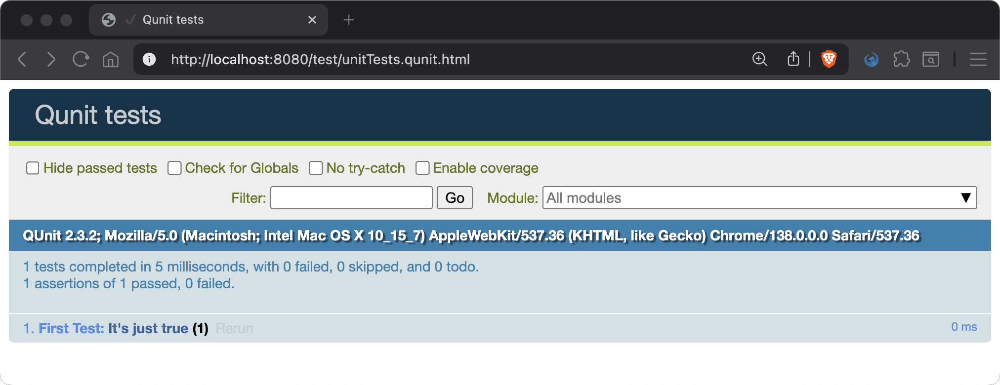
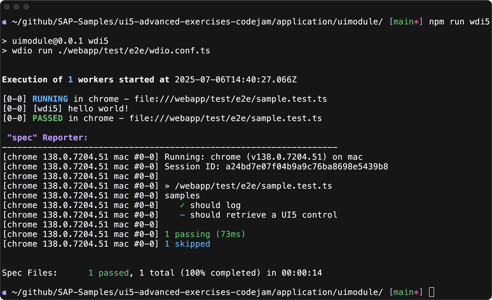

# Chapter 06 - Testing: Current Project Setup

By the end of this chapter, we will know how to run QUnit and WDI5 test as part of our existing project configuration.

## Steps

- [1. Run basic QUnit test](#1-run-basic-qunit-test)<br>
- [2. Run basic WDI5 test](#2-run-basic-wdi5-test)<br>

## Background Information

*QUnit* tests are used for functional testing, allowing us to directly test our application code. *OPA* tests serve as integration tests, enabling us to simulate user interactions within the application. *WDI5* tests are end-to-end (E2E) tests that let us validate the application in a broader context, including navigation between different applications.

*QUnit* or *OPA* tests are included in UI5 and can be simply executed in the browser. They can either be opened directly in the browser or be triggered using a test runner to automate the execution.

The easy-ui5 project generator (that we used in [chapter 01](/chapters/01-generating-full-stack-project)) already added some basic *QUnit* and *WDI5* tests incl. configuration. The structure looks as follows:

```text
webapp
\_ test
   \_ e2e
      \_ sample.test.ts
      \_ tsconfig.json
      \_ wdio.conf.ts
   \_ unit
      \_ FirstTest.js
   \_ locate-reuse-libs.js
```

### 1. Run basic QUnit test

➡️ Run the following command from the `codejam.supermarket/uimodule/` directory to execute the *QUnit* tests:

```sh
# make sure you are in the uimodule/ directory
npm run qunit
```

This will launch the SAP Fiori tools (`fiori run ...`) which provides built-in boilerplate files to serve and run all available *QUnit* test (`*Test.js` or `*Test.ts` files in the `unit/` directory) in the browser.

You might have noticed we started the `uimodule` decoupled from the backend server for the first time. We can do that in this case as the unit tests don't rely on the UI5 app to be fully functional and operating against the backend server.

>⚠ Although we generated a TypeScript project, the generated QUnit test is currently using JavaScript. Feel free to change the file extension to `.ts` and remove the UI5 AMD-like code (`sap.ui.define`). Now the code looks like this:
>
>```ts
>QUnit.module("First Test", {});
>
>QUnit.test("It's just true", (assert) => {
>	assert.strictEqual(true, true);
>});
>```



### 2. Run basic WDI5 test

➡️ Replace the `baseUrl` value in the `codejam.supermarket/uimodule/webapp/test/e2e/wdio.conf.ts` file with the following url:

```text
http://localhost:4004/uimodule/index.html
```

> ➡️ In case you are using the SAP Business Application Studio, also follow these instruction to configure `wdi5` correctly: [wdi5 documentation](https://ui5-community.github.io/wdi5/#/usage?id=using-bas-with-wdi5).

➡️ Start the project as usual from the `codejam.supermarket/` directory:

```sh
# make sure you are in the codejam.supermarket/ directory (project root)
npm run dev:server
```

➡️ Open a new terminal (don't reuse the other one!) and run the following command from the `codejam.supermarket/uimodule/` directory to execute the *WDI5* tests (testing against the already running server):

```sh
# make sure you are in the uimodule/ directory
npm run wdi5
```

This will launch the *WDI5* tests defined in the `codejam.supermarket/uimodule/webapp/test/e2e/sample.test.ts` file. The file is functionally empty (as the actual test is being skipped) but it's still nice to know how to trigger this built-in test configuration.



Continue to [Chapter 07 - Testing: Recreating Setup](/chapters/07-testing-recreating-setup/)
