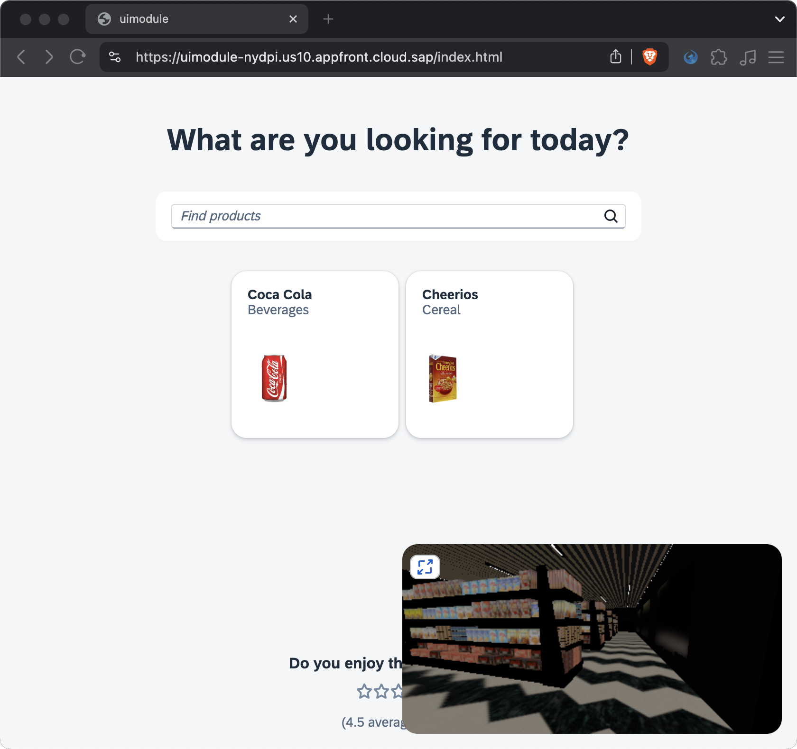

# Chapter 07 - Deployment

By the end of this chapter we will have deployed our application to the Application Frontend service on SAP Business Technology Platform (BTP).

## Steps

### 1. Add `conf.json` file

The [Application Frontend service](https://help.sap.com/docs/application-frontend-service/application-frontend-service/what-is-application-frontend-service) on SAP BTP let's us deploy frontend applications in a very simple way using a single command (which we will get to shortly), but in order for our application to be functional, it requires some connection details. Specifically we need to provide destination configuration details for the CAP backend service and the UI5 CDN, as well an XSUAA service key from the service instance that the backend service is protected with. The Application Frontend service uses a managed [approuter](https://www.npmjs.com/package/@sap/approuter) under the hood to process these configuration details.

➡️ Create a new `codejam.supermarket/uimodule/conf.json` file with the following content:

```json

```

The above configuration is necessary, because we deploy the UI5 application seperately from the CAP backend service, which is conveniently already deployed for us (at `https://developer-advocates-free-tier-central-hana-cloud-instan6cbdb864.cfapps.us10.hana.ondemand.com`). This backend service is protected with XSUAA, which is why we need to provide a service key, so that the managed approuter of the Application Frontend service can handle the authentication and authorization for us.

### 2. Modify the `build` script of the uimodule

➡️ Change the `build` script in the `codejam.supermarket/uimodule/package.json` file to:

```json
"build": "ui5 build",
```

A simple `ui5 build` is sufficient for our use case, as we will consume UI5 from the CDN (see `conf.json`). Our build result therefore doesn't need to be `self contained`, i.e. it doesn't need to include all UI5 libraries.

### 3. Build the uimodule

➡️ Execute the following command from the `codejam.supermarket/uimodule/` directory:

```bash
npm run build
```

This will create a `dist` directory in the `uimodule` directory, which contains the build result of our UI5 application.

### 4. Install the `afctl` CLI tool

The Application Frontend service provides a command line tool called [`afctl`](https://www.npmjs.com/package/@sap/appfront-cli) to deploy applications to the service. This tool is available as an npm package.

➡️ Execute the following command in the terminal to install `afctl` globally:

```bash
npm i @sap/appfront-cli -g
```

Alternatively, we could also install the tool locally (as part of this project), but it's more convenient to have a available globally, as we will frequently have to login and perhaps use other commands as well (activate other versions, get logs, etc.).

### 5. Login to the Application Frontend service

➡️ Execute the following command in the terminal and follow the instructions to log in to the Application Frontend service:

```bash
afctl login -a https://api.us10.dt.appfront.cloud.sap?apptid=f1817fd2-ea17-40b6-9e78-21248300aae4 --sso
```

### 6. Deploy the application

➡️ Execute the following command from the `codejam.supermarket/uimodule/` directory to deploy the application:

```bash
afctl push dist -c conf.json -l
```

The deployment of the application may take a while, as the `supermarket.glb` file is quite large (around 70MB). If you are interested, you can add a verbose flag (`-v`) to the above command to get more details about the deployment process.

### 7. Test the application

➡️ Open the URL provided in the terminal output to test the deployed application.




deploy CAP backend
Subscribe to app-front
Add users to IAS tenant
Create role collection with roles in BTP Cockpit
afctl login
afctl push dist -c conf.json -l
