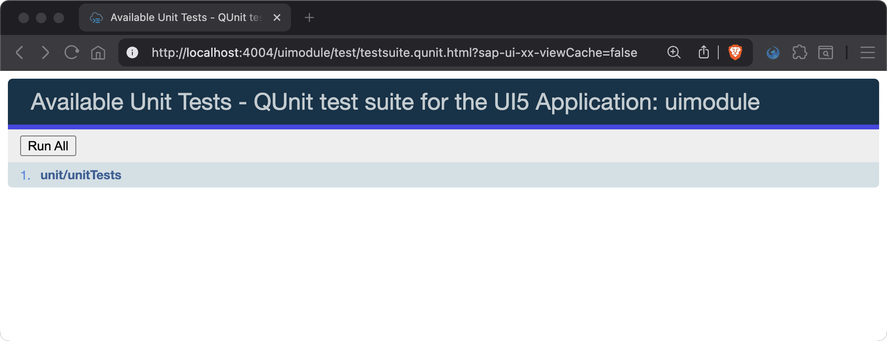
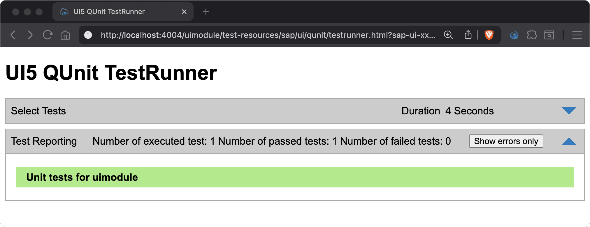
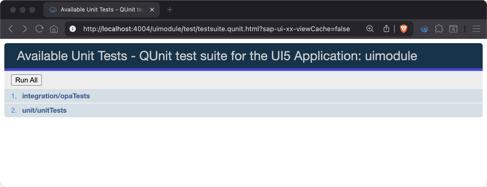
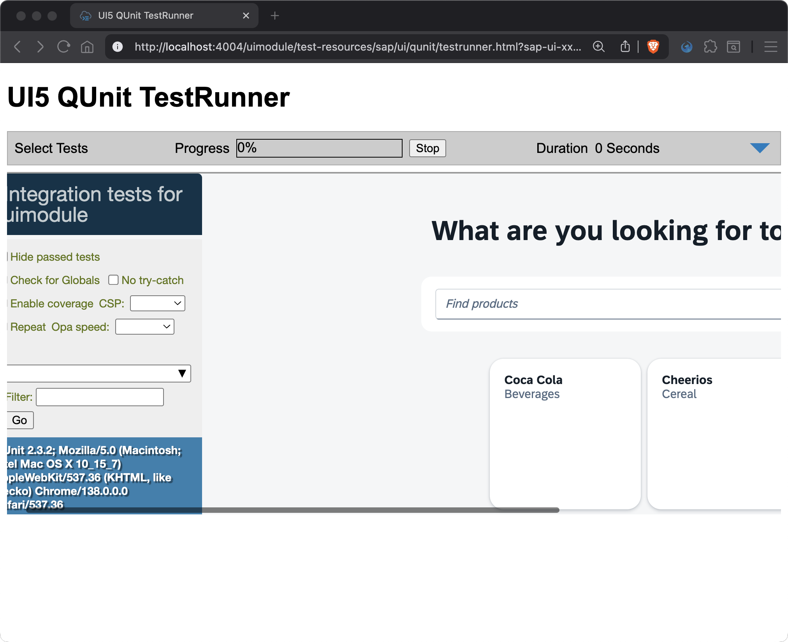
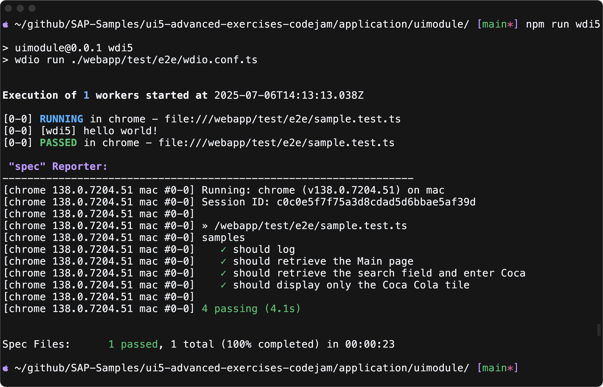

# Chapter 07 - Testing: Recreating Setup

By the end of this chapter, we will know how to recreate and execute a holistic testing setup including QUnit, OPA, and WDI5 tests.

## Steps

- [1. Add `testsuite.qunit.html` (test suite)](#1-add-testsuitequnithtml-test-suite)<br>
- [2. Add `testsuite.qunit.ts` (test suite)](#2-add-testsuitequnitts-test-suite)<br>
- [3. Add `Test.qunit.html` (test suite)](#3-add-testqunithtml-test-suite)<br>
- [4. Add `unitTests.qunit.ts` (list of unit tests)](#4-add-unittestsqunitts-list-of-unit-tests)<br>
- [5. Add `Main.qunit.ts` (unit test)](#5-add-mainqunitts-unit-test)<br>
- [6. Register the list of unit tests in the test suite](#6-register-the-list-of-unit-tests-in-the-test-suite)<br>
- [7. Run the QUnit tests](#7-run-the-qunit-tests)<br>
- [8. Add `opaTests.qunit.ts` (list of OPA journeys)](#8-add-opatestsqunitts-list-of-opa-journeys)<br>
- [9. Add `HelloJourney.qunit.ts` (OPA journey)](#9-add-hellojourneyqunitts-opa-journey)<br>
- [10. Add `MainPage.ts` (page object)](#10-add-mainpagets-page-object)<br>
- [11. Register the list of OPA journeys in the test suite](#11-register-the-list-of-opa-journeys-in-the-test-suite)<br>
- [12. Run the QUnit tests](#12-run-the-qunit-tests)<br>
- [13. Implement WDI5 tests](#13-implement-wdi5-tests)<br>
- [14. Run the WDI5 tests](#14-run-the-wdi5-tests)<br>

### 1. Add `testsuite.qunit.html` (test suite)

In case we need a bit more control over the generated files, we can also create the boilerplate files manually. This allows us to specify the *QUnit* or *Sinon* version in the test suite as well as to maintain a list of tests to be executed. The tests are triggered by the [UI5 test starter](https://sdk.openui5.org/topic/032be2cb2e1d4115af20862673bedcdb). The concept of UI5 test suite is explained here in the UI5 documentation: [https://sdk.openui5.org/#/topic/22f50c0f0b104bf3ba84620880793d3f]()

In this and the subsequent two steps we will create the following file structure, which is essentially the boilerplate required to run *QUnit* and *OPA* tests - the so-called *test suite*:

```text
webapp
\_ test
   \_ testsuite.qunit.html
   \_ testsuite.qunit.ts
   \_ Test.qunit.html
```

➡️ Create a new `codejam.supermarket/uimodule/test/testsuite.qunit.html` file with the following content:

```html
<!doctype html>
<html>
	<head>
		<meta http-equiv="Cache-control" content="no-cache, no-store, must-revalidate" />
		<meta http-equiv="Pragma" content="no-cache" />
		<meta http-equiv="expires" content="0" />
		<meta charset="utf-8" />
		<title>QUnit test suite for the UI5 Application: uimodule</title>
		<script
			src="../resources/sap/ui/test/starter/createSuite.js"
			data-sap-ui-testsuite="test-resources/uimodule/testsuite.qunit"
			data-sap-ui-resource-roots='{
				"test-resources.uimodule": "./"
			}'
		></script>
	</head>
	<body></body>
</html>
```

### 2. Add `testsuite.qunit.ts` (test suite)

The HTML page requires a test suite which needs to be put aside.

➡️ Create a new  `codejam.supermarket/uimodule/test/testsuite.qunit.ts` file with the following content:

```js
export default {
	name: "QUnit test suite for the UI5 Application: uimodule",
	defaults: {
		page: "ui5://test-resources/uimodule/Test.qunit.html?testsuite={suite}&test={name}",
		qunit: {
			version: 2
		},
		sinon: {
			version: 4
		},
		ui5: {
			language: "EN",
			theme: "sap_horizon"
		},
		coverage: {
			only: "uimodule/",
			never: "test-resources/uimodule/"
		},
		loader: {
			paths: {
				"uimodule": "../"
			}
		}
	},
	tests: {}
};
```

### 3. Add `Test.qunit.html` (test suite)

The test suite defines a test page which is used to execute the tests declared in that file as well.

➡️ Create a new `codejam.supermarket/uimodule/test/Test.qunit.html` file with the following content:

```html
<!doctype html>
<html>
	<head>
		<meta charset="utf-8" />
		<script
			src="../resources/sap/ui/test/starter/runTest.js"
			data-sap-ui-resource-roots='{
				"test-resources.uimodule": "./"
			}'
		></script>
	</head>
	<body class="sapUiBody">
		<div id="qunit"></div>
		<div id="qunit-fixture"></div>
	</body>
</html>
```

### 4. Add `unitTests.qunit.ts` (list of unit tests)

The *QUnit* tests itself are typically put into the following structure:

```text
webapp
\_ test
   \_ unit
      \_ unitTests.qunit.ts
      \_ controller
         \_ Main.qunit.ts
```

The `unitTests.qunit.ts` file lists the individual *QUnit* test pages to be executed via the test suite. We use it to import the modules providing *QUnit* modules and tests.

➡️ Create a new `codejam.supermarket/uimodule/test/unit/unitTests.qunit.ts` file with the following content:

```ts
// import all QUnit tests here
import "./controller/Main.qunit";
```

### 5. Add `Main.qunit.ts` (unit test)

The `Main.qunit.ts` file now defines *QUnit* modules and tests. A very basic check is to test the availability of a function in the `Main.controller` of the application.

➡️ Create a new `codejam.supermarket/uimodule/test/unit/controller/Main.qunit.ts` file with the following content:

```ts
import Main from "uimodule/ext/main/Main.controller";

QUnit.module("Sample Main controller test");

QUnit.test("The Main controller class has a onFlyToProduct method", function (assert) {
	assert.strictEqual(typeof Main.prototype.onFlyToProduct, "function");
});
```

### 6. Register the list of unit tests in the test suite

➡️ Add the following code to the `tests` section of the `codejam.supermarket/uimodule/test/testsuite.qunit.ts`:

```ts
		"unit/unitTests": {
			title: "Unit tests for uimodule"
		}
```

With this step we registered the list of unit tests (`unitTests.qunit.ts`) in the test suite.

### 7. Run the *QUnit* tests

We can now run our *QUnit* tests in the browser.

➡️ Run the following command from the `codejam.supermarket/uimodule/` directory to start the UI5 application (without the backend server):

```sh
# make sure you are in the uimodule/ directory
npm start
```

➡️ Open the test suite at [http://localhost:8080/test/testsuite.qunit.html]() to run the *QUnit* tests. You can run all tests at once by pressing **Run All** or click on the individual *QUnit* tests to execute.




### 8. Add `opaTests.qunit.ts` (list of OPA journeys)

*OPA* tests typically consist of journeys and page objects. They are typically put into the following structure:

```text
webapp
\_ test
   \_ integration
      \_ opaTests.qunit.ts
      \_ HelloJourney.qunit.ts
      \_ pages
         \_ MainPage.ts
```

The `opaTests.qunit.ts` file lists the individual *OPA* journeys to be executed via the test suite. We use it to import the modules providing *OPA* journeys.

➡️ Create a new `codejam.supermarket/uimodule/test/integration/opaTests.qunit.ts` file with the following content:

```ts
// import all journeys here
import "./HelloJourney.qunit";
```

### 9. Add `HelloJourney.qunit.ts` (OPA journey)

The `HelloJourney.qunit.ts` implements the test journey to simulate an interaction with the application.

➡️ Create a new `codejam.supermarket/uimodule/test/integration/HelloJourney.qunit.ts` file with the following content:

```ts
import opaTest from "sap/ui/test/opaQunit";
import MainPage from "./pages/MainPage";

const onTheMainPage = new MainPage();

QUnit.module("Sample Journey");

opaTest("Should search for Coca-Cola", function () {
	// Arrangements
	onTheMainPage.iStartMyUIComponent({
		componentConfig: {
			name: "uimodule"
		}
	});

	// Actions
	onTheMainPage.iPressTheSearchField();
	onTheMainPage.iEnterSearchText();

	// Assertions
	onTheMainPage.iShouldOnlySeeCocaCola();

	// Cleanup
	onTheMainPage.iTeardownMyApp();
});
```

In this journey we open the application, search for "Coca" and check that a single tile is visible with "Coca-Cola" as title.
Typically, the actions and assertions calls itself are outsourced to so-called page objects. Page objects are related to a single view - in our case to the `Main` view.

### 10. Add `MainPage.ts` (page object)

The page object implements actions to interact and assertions to check the behavior of the UI.

In your `test/integration/pages` folder, please add a file called `MainPage.ts` with the following content:

```ts
import Opa5 from "sap/ui/test/Opa5";
import Press from "sap/ui/test/actions/Press";
import EnterText from "sap/ui/test/actions/EnterText";
import GenericTile from "sap/m/GenericTile";
import UI5Element from "sap/ui/core/Element";


const viewName = "uimodule.ext.main.Main";

export default class MainPage extends Opa5 {
	// Actions
	iPressTheSearchField() {
		this.waitFor({
			id: "searchField",
			viewName,
			actions: new Press(),
			errorMessage: "Did not find the search field on the Main view"
		});
	}

	iEnterSearchText() {
		this.waitFor({
			id: "searchField",
			viewName,
			actions: new EnterText({
				text: "Coca"
			}),
			errorMessage: "Did not find the search field on the Main view and could not enter text"
		});
	}

	// Assertions
	iShouldOnlySeeCocaCola() {
		this.waitFor({
			controlType: "sap.m.GenericTile",
			success: function (tiles: UI5Element[]) : void {
				Opa5.assert.equal(tiles.length, 1, "Only on tile is visible");
				Opa5.assert.equal((tiles[0] as GenericTile).getHeader(), "Coca Cola", "The correct tile is visible");
			},
			errorMessage: "Did not find the tile"
		});
	}
}
```

### 11. Register the list of OPA journeys in the test suite

➡️ Add the following code to the `tests` section of the `codejam.supermarket/uimodule/test/testsuite.qunit.ts`:


```ts
,
		"integration/opaTests": {
			title: "Integration tests for uimodule"
		}
```

Now, you can run your *OPA* tests in the browser together with the *QUnit* tests by starting the project with the command line `npm run start:uimodule` in the `application` directory. After the server is running, you can open the testsuite with the following URL: [http://localhost:8080/test/testsuite.qunit.html]() (ensure that the same port is used) and press **Run All** or click on the individual *OPA* test to execute.

### 12. Run the *QUnit* tests

We can now run our *OPA* (integration) tests (together with the unit tests from before) in the browser. But this time we need to start the whole project, including the backend server, as we are testing the app in action and therefore need it to be fully functional.

➡️ Run the following command from the `codejam.supermarket/` directory to start the UI5 application together with the backend server:

```sh
# make sure you are in the codejam.supermarket/ directory (project root)
npm run dev:server
```

➡️ Open the test suite at [http://localhost:4004/uimodule/test/testsuite.qunit.html]() to run the *OPA* (integration) and unit tests. You can run all tests at once by pressing **Run All** or click on the individual tests to execute.




### 13. Implement *WDI5* tests

The initial project template already came with the boilerplate for *WDI5* tests. We have already used the basic configuration to start a simple test at the beginning of this chapter ([step 2](#2-run-basic-wdi5-test)).

This is the current structure of the *WDI5* tests:

```text
webapp
\_ test
   \_ e2e
      \_ sample.test.ts
      \_ tsconfig.json
      \_ wdio.conf.ts
```

The `sample.test.ts` is initially a very basic test which does some simple logging. Let's extend the test to do the same as the *OPA* test - checking the existence of the `Page`, the `SearchField` and searching for "Coca" to ensure that only the respective tile is displayed.

➡️ Replace the content of the `codejam.supermarket/uimodule/test/e2e/sample.test.ts` file with the following code:

```ts
/* eslint-disable */
import GenericTile from "sap/m/GenericTile";
import { wdi5 } from "wdio-ui5-service";

describe("samples", () => {
	it("should log", () => {
		const logger = wdi5.getLogger();
		logger.log("hello world!");
	});

	it("should retrieve the Main page", async () => {
		const appLocator = {
			selector: {
				controlType: "sap.m.Page",
				viewName: "uimodule.ext.main.Main",
			},
		};

		const app = await browser.asControl(appLocator);
		await expect(app).toBeDefined();
	});

	it("should retrieve the search field and enter Coca", async () => {
		const searchLocator = {
			selector: {
				id: "searchField",
				viewName: "uimodule.ext.main.Main",
			},
		};

		const search = await browser.asControl(searchLocator);
		await expect(search).toBeDefined();
		await (browser.asControl(searchLocator) as any).focus().enterText("Coca");
		await expect(search).toHaveValue("Coca");
	});

	it("should display only the Coca Cola tile", async () => {
		const tilesLocator = {
			selector: {
				controlType: "sap.m.GenericTile",
				viewName: "uimodule.ext.main.Main",
			},
		};

		const tiles = await browser.allControls(tilesLocator) as GenericTile[];
		await expect(tiles.length).toBe(1);
		await expect(await tiles[0].getHeader()).toBe("Coca Cola");
	});
});
```

### 14. Run the *WDI5* tests

To run the *WDI5* tests, we need to start the project as usual from the project root, including the backend server.

➡️ Run the following command from the `codejam.supermarket/` directory:

```sh
# make sure you are in the codejam.supermarket/ directory (project root)
npm run dev:server
```

➡️ Open a new terminal (don't reuse the other one!) and run the following command from the `codejam.supermarket/uimodule/` directory to execute the *WDI5* tests (testing against the already running server):

```sh
# make sure you are in the uimodule/ directory
npm run wdi5
```

You will notice how the *WDI5* tests are executed in the browser, similar to the *OPA* tests. The test results are displayed in the terminal.



Continue to [Chapter 08 - Testing: Automating Tests](/chapters/08-testing-automating-tests/)
