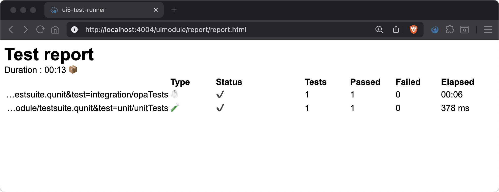

# Chapter 08 - Testing: Automating Tests

By the end of this chapter, we will know how to automate our test setup.

## Steps

- [1. Configure `ui5-test-runner` (test automation)](#1-configure-ui5-test-runner-test-automation)<br>
- [2. Start the `ui5-test-runner`](#2-start-the-ui5-test-runner)<br>

### 1. Configure `ui5-test-runner` (test automation)

In the past, *Karma* was used for the automated execution of *QUnit* and/or *OPA* tests. As *Karma* has been deprecated, two alternatives emerged:

1. [ui5-test-runner](https://arnaudbuchholz.github.io/ui5-test-runner/)
1. [wdio-qunit-service](https://webdriver.io/docs/wdio-qunit-service/)

Both can be seen as drop-in replacement to *Karma*, but *wdio-qunit-service* makes most sense, if *WDI5* is already in use. The [openui5-sample-app](https://github.com/SAP/openui5-sample-app) is using the `ui5-test-runner`, which is why we also use it here. Luckily, there is not much configuration to do - we only have to install the package and add a script to our `package.json` file.

➡️ Run the following command from the `codejam.supermarket/uimodule/` directory:

```sh
# make sure you are in the uimodule/ directory
npm install ui5-test-runner -D
```

➡️ Add the following code to the `scripts` section of the `codejam.supermarket/uimodule/package.json` file:

```json
,
		"test-runner": "ui5-test-runner --url http://localhost:4004/uimodule/test/testsuite.qunit.html --report-dir webapp/report"
```

### 2. Start the `ui5-test-runner`

To start the `ui5-test-runner`, we need to start the project as usual from the project root, including the backend server.

➡️ Run the following command from the `codejam.supermarket/` directory:

```sh
# make sure you are in the codejam.supermarket/ directory (project root)
npm run dev:server
```

➡️ Open a new terminal (don't reuse the other one!) and run the following command from the `codejam.supermarket/uimodule/` directory to start the tests:

```sh
# make sure you are in the uimodule/ directory
npm run test-runner
```

You'll notice how the tests are being executed [headless](https://en.wikipedia.org/wiki/Headless_browser). Feel free to inspect the test results at [http://localhost:4004/uimodule/report/report.html]().



Continue to [Chapter 09 - Deployment](/chapters/09-deployment/)
