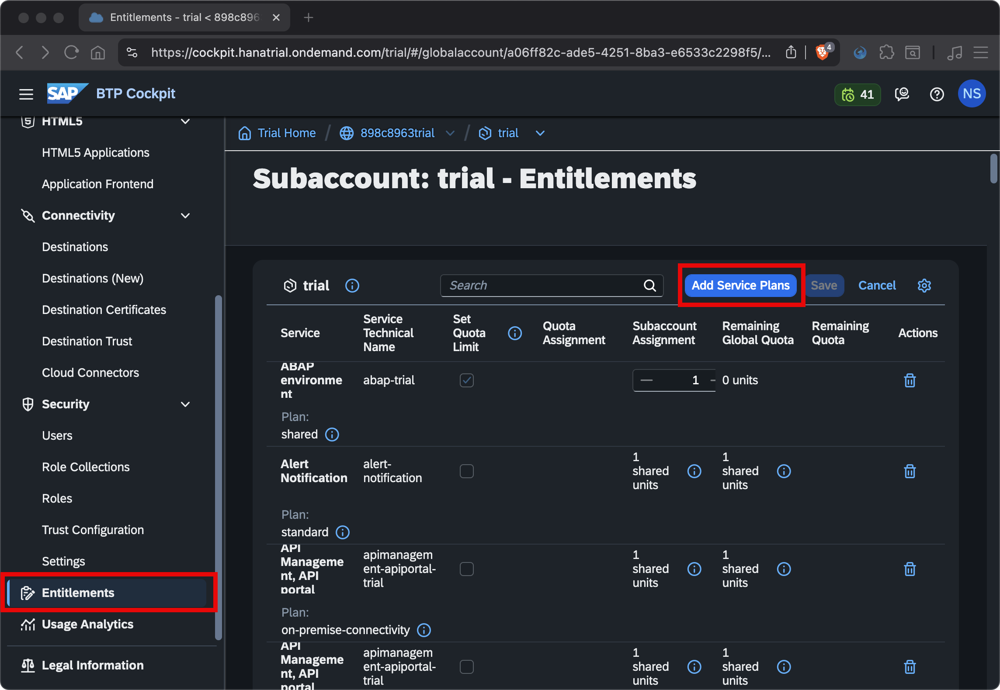
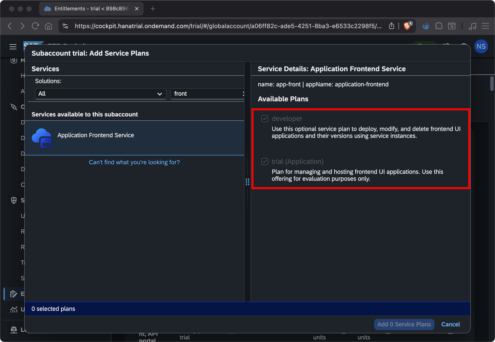
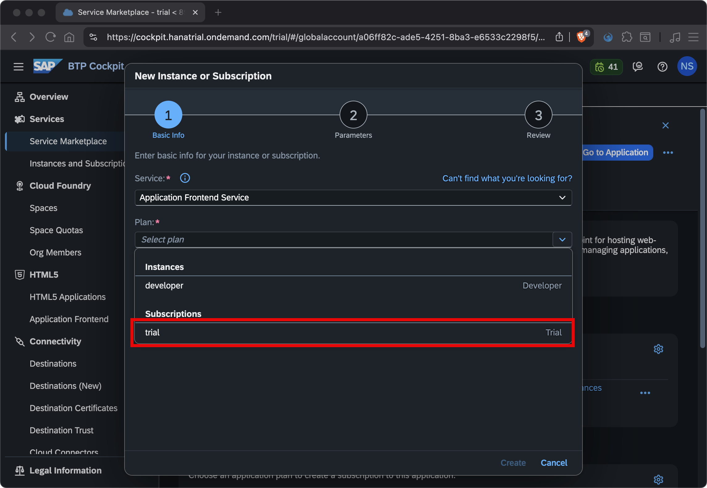
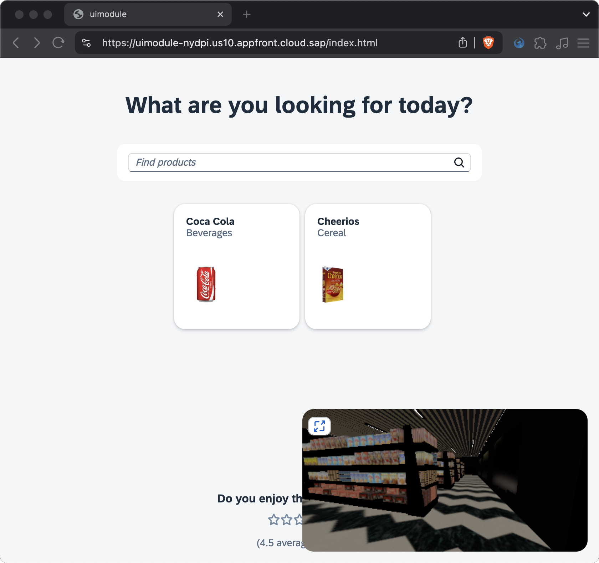

# Chapter 09 - Deployment

By the end of this chapter we will have deployed our application to the Application Frontend service on SAP Business Technology Platform (BTP).

## Steps

- [1. Get an account on SAP BTP trial and configure SAP Cloud Identity Services](#1-get-an-account-on-sap-btp-trial-and-configure-sap-cloud-identity-services)<br>
- [2. Provision an instance of SAP HANA Cloud](#2-provision-an-instance-of-sap-hana-cloud)<br>
- [3. Entitle the Application Frontend Service](#3-entitle-the-application-frontend-service)<br>
- [4. Subscribe to the Application Frontend Service](#4-subscribe-to-the-application-frontend-service)<br>
- [5. Create role collections and assign them to your user](#5-create-role-collections-and-assign-them-to-your-user)<br>
- [6. Edit uimodule to use the CDN](#6-edit-uimodule-to-use-the-cdn)<br>
- [7. Deploy the project](#7-deploy-the-project)<br>
- [8. Access the deployed application](#8-access-the-deployed-application)<br>

### 1. Get an account on SAP BTP trial and configure SAP Cloud Identity Services

The [Application Frontend Service](https://help.sap.com/docs/application-frontend-service/application-frontend-service/what-is-application-frontend-service) on SAP BTP allows us to deploy frontend applications in two ways: (1) via MTAs (Multi-Target Applications) and (2) via the [`afctl`](https://www.npmjs.com/package/@sap/appfront-cli) command line interface. This offers great flexibility, as we can deploy the whole project via an MTA once, and then hot-deploy only the frontend only if we make changes along the way. It's also possible to exclusively use the `afctl` approach if we wanted to.
Generally speaking, the Application Frontend service provides a managed [approuter](https://www.npmjs.com/package/@sap/approuter), that's allows us to handle user request and connect to other system, without requiring a separate application.

➡️ Follow these instructions on how to create an account on SAP BTP trial and configure the SAP Cloud Identity Services to use it with the Application Frontend Service: [https://help.sap.com/docs/application-frontend-service/application-frontend-service/setup-in-sap-btp-trial]() 

### 2. Provision an instance of SAP HANA Cloud

➡️ Follow the instruction of the following tutorial (and other tutorials it is linking to): [https://developers.sap.com/tutorials/hana-cloud-deploying.html]()

### 3. Entitle the Application Frontend Service

➡️ Go into the **Entitlements** section of your SAP BTP trial account and add the **Application Frontend Service** to your account. Add both the `trial` and `developer` plans:




### 4. Subscribe to the Application Frontend Service

➡️ Go into the **Instances and Subscriptions** section of your SAP BTP trial account and create a new subscription to the **Application Frontend Service**. Select the `trial` plan:



### 5. Create role collections and assign them to your user

➡️ Follow these instructions: [https://help.sap.com/docs/application-frontend-service/application-frontend-service/creating-role-collections-and-assigning-them-to-users]()a

### 6. Edit uimodule to use the CDN

Our project is actually already configured to use the Application Frontend Service, as we configured the deployment target during the project generation in [chapter 01](/chapters/01-generating-a-full-stack-project/). We only have to two small tweaks to make it work for our scenario: To make the build result of our application smaller, we want to use consume the UI5 libraries via the CDN, instead of bundling them into our application (our application is already quite big due to the 3D model).

➡️ Replace the current `build` script in the `codejam.supermarket/uimodule/package.json` file with the following code:

```json
        "build": "ui5 build",
```

We removed the `self-contained` option from the build script, as we don't want to bundle the UI5 libraries into our application.

➡️ Replace the UI5 bootstrap url (`src`) in the `codejam.supermarket/uimodule/webapp/index.html` file with the following url:

```text
https://ui5.sap.com/1.108/resources/sap-ui-core.js
```

Our application now consumes the UI5 libraries from the CDN, which will reduce the size of our application. We opted for an older long term support version of the SAPUI5, as we had issues with newer versions at the time of writing (July 2025).

### 7. Deploy the project

➡️ Make sure you have the Cloud Foundry CLI installed on your machine: [https://developers.sap.com/tutorials/cp-cf-download-cli..html]()

➡️ Login to your SAP BTP trial account (you can find your API endpoint on the overview page of your SAP BTP subaccount):

```bash
cf login -a <API_ENDPOINT>
```

➡️ Build and deploy your project with the following commands:

```
#make sure you are in the codejam.supermarket directory (project root)
npm run build
npm run deploy
```

### 8. Access the deployed application

➡️ Go to the **HTML5** > **Application Frontend** section in your SAP BTP trial account and open the `uimodule` application. You will have to log in with the account you created as part of [step 1](#get-an-account-on-sap-btp-trial-and-configure-sap-cloud-identity-services):




## Further questions to discuss

- How did you like this SAP CodeJam?
- Why are you still here? Enjoy your ["Feierabend"](https://expath.com/knowledge-base/germany/what-does-feierabend-mean)!
